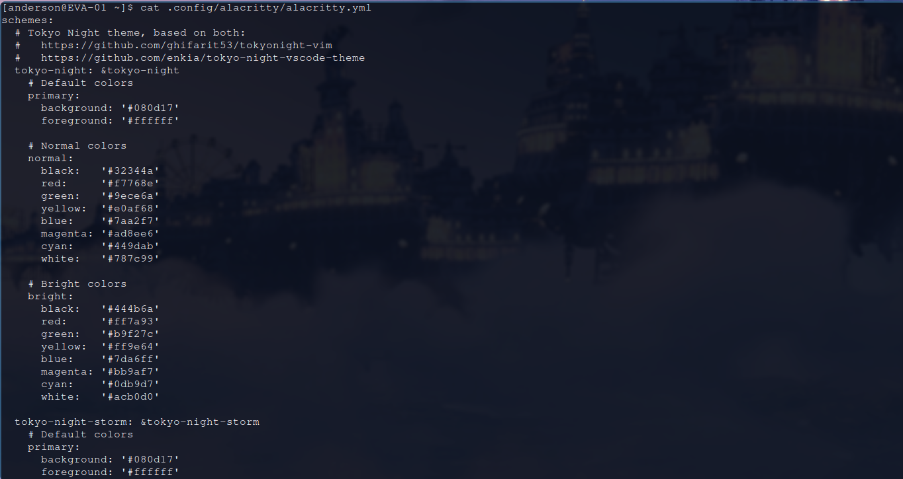
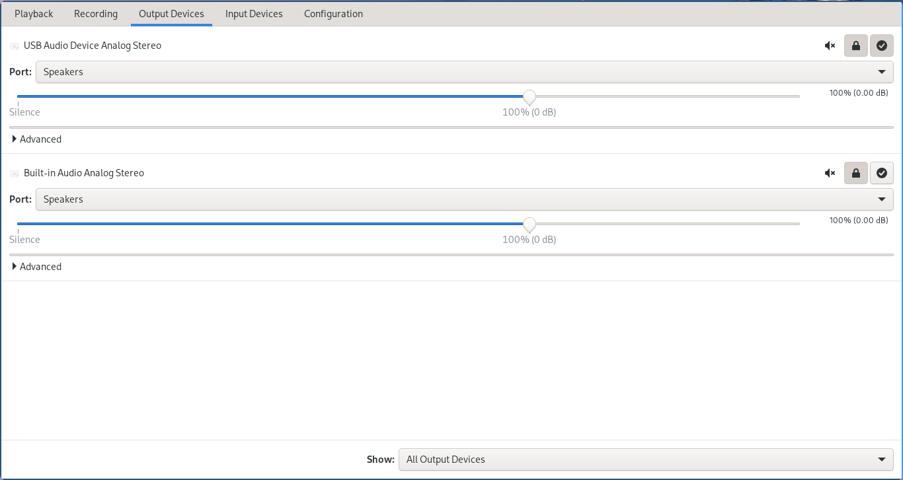

# Arch Linux Files

Nesse repositorio estao os arquivos de configuraçao do meu arch!

## Instalaçao

Para a instalaçao, usei esses dois manuais:

https://wiki.archlinux.org/title/Installation_guide

https://gist.github.com/iagobueno/7ee556f787f5ee2a60e2faed0d95e4f4

Claro que durante o processo voce ira encontrar varios erros, mas se esta 
aqui e realmente vai usar essas informaçoes, tenho certeza que voce consegue
resolver esses erros!

## Algumas inspiraçoes:

https://github.com/AndrewLockVI/I3-Dark-Ocean/tree/main

https://github.com/ART3MISTICAL/dotfiles/tree/main

https://dev.to/lissatransborda/criando-um-ambiente-de-desenvolvimento-minimalista-32o9

## Rofi

`sudo pacman -S rofi`

https://wiki.archlinux.org/title/Rofi

E um alternador de janelas, diálogo de execução, lançador ssh. (Menu legal)

## Polybar

`yay -S polybar`

https://wiki.archlinux.org/title/Polybar

uma ferramenta rápida e fácil de usar para criar barras de status. O seu 
objetivo é ser facilmente personalizável, utilizando muitos módulos que 
permitem uma vasta gama de funcionalidades (editáveis), tais como a 
apresentação de espaços de trabalho, a data ou o volume do sistema. 
(Barra de informaçoes de sistema legal)

## Alacritty

`pacman -S alacritty`

https://wiki.archlinux.org/title/Alacritty

E um emulador de terminal simples, acelerado por GPU, escrito em Rust.
(Terminal legal)

## Feh

Dois monitores  de dimesoes diferentes..

`sudo pacman -S feh`

https://wiki.archlinux.org/title/Feh#As_a_desktop_wallpaper_manager

E um visualizador de imagens leve destinado principalmente a utilizadores 
de interfaces de linha de comandos. (Gerenciador de plano de fundo legal)

## PulseAudio

`sudo pacman -S pulseaudio`

https://wiki.archlinux.org/title/PulseAudio

E um servidor de som de uso geral destinado a funcionar como um middleware 
entre as suas aplicações e os seus dispositivos de hardware, quer utilizando 
ALSA ou OSS. (Gerenciador de som legal)

- Para a interface grafica do controlador usei o Pavucontrol:
`sudo pacman -S pavucontrol`

https://archlinux.org/packages/extra/x86_64/pavucontrol/

## Vim

`sudo pacman -S vim`

https://wiki.archlinux.org/title/Vim

Editor de texto legal

---

* Para o bloqueio, usei o i3lock mesmo.
